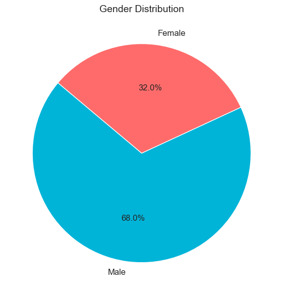
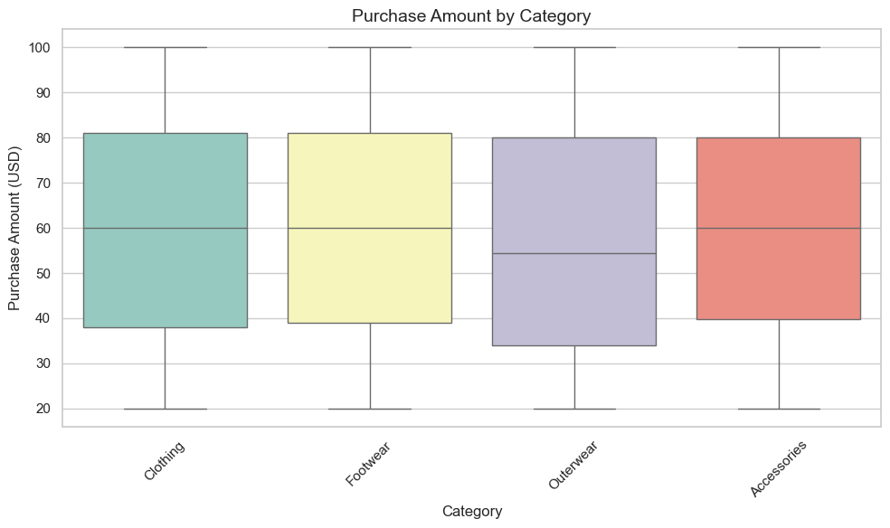
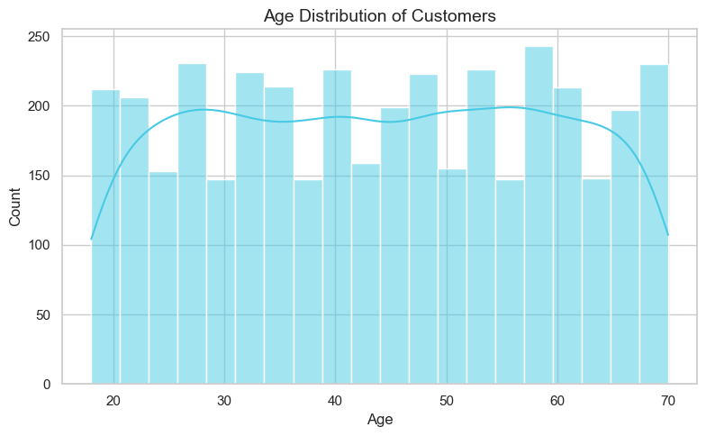
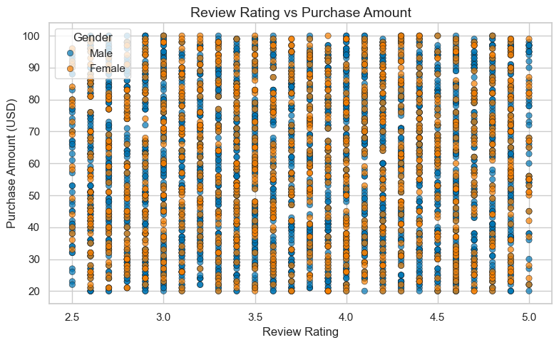

# 🛍️ Shopping Trend Analysis

This project analyzes customer shopping behavior to uncover insights into product preferences, demographics, and purchase trends. The analysis uses Python libraries such as Pandas, Matplotlib, and Seaborn to perform data cleaning, visualization, and exploration of retail data.

---

## 📌 Key Insights from the Data

- 👕 **Clothing and Accessories** are the top purchased categories, showing high interest in fashion-related products.
- 👨 **Male customers** make up 68% of purchases; females contribute 32%, indicating a noticeable gender gap.
- 💵 **Purchase amounts** are similar across categories, with Clothing and Footwear having greater variability.
- 👥 **Shoppers aged 25–60** are the most active, showing balanced engagement across working-age groups.
- 🌟 **Review ratings** do not have a strong link to how much customers spend—high-value purchases exist at all satisfaction levels.

These insights can help businesses design targeted marketing strategies, improve customer experience, and refine product offerings.

---

## 📊 Visualizations & Analysis

### 1️⃣ Top Categories Purchased
---

 
   
---
- Clothing is the most purchased category, followed by Accessories, Footwear, and Outerwear.
- Indicates strong customer interest in fashion-related items.

---

### 2️⃣ Gender Distribution



- Male customers account for 68% of purchases.
- Female customers make up 32%, suggesting potential to target underrepresented buyers.

---

### 3️⃣ Purchase Amount by Category

 

- All categories have similar median purchase amounts (~$60).
- Footwear and Clothing show wider spending ranges.

---

### 4️⃣ Age Distribution of Customers



- Customers between 25–60 years are the most active.
- Consistent engagement across adult age groups indicates wide appeal.

---

### 5️⃣ Review Rating vs Purchase Amount




- Spending levels are scattered across all rating values.
- No clear correlation between satisfaction (rating) and amount spent.

---

## 📦 Dataset Source

> [Kaggle: Superstore Dataset](https://www.kaggle.com/datasets/vivek468/superstore-dataset-final)  
(Replace this with your real dataset link if different.)

---

## 🧰 Technologies Used

- Python
- Pandas
- NumPy
- Matplotlib
- Seaborn
- Jupyter Notebook

---

## 🚀 How to Run the Project

1. **Clone this repository:**
   ```bash
   git clone https://github.com/your-username/shopping-trend-analysis.git
   cd shopping-trend-analysis
